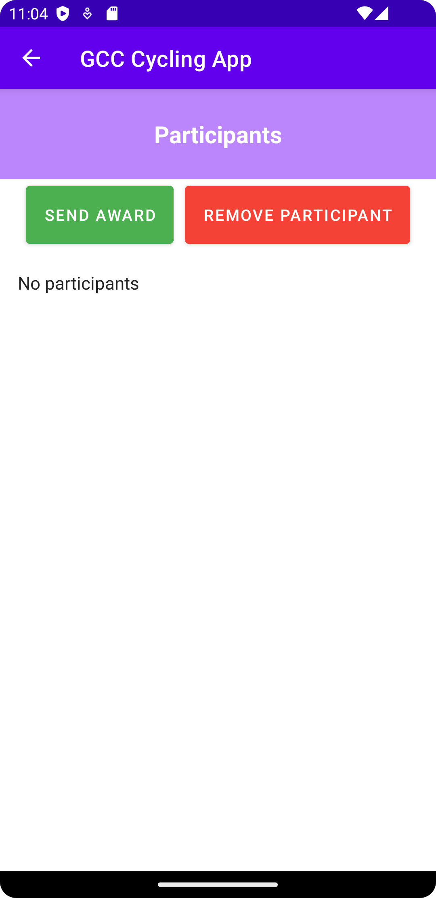

# GCCycling

## About

The Grimpeurs Cycling Club (GCC) App is an advanced mobile application designed to address the multifaceted needs of cycling enthusiasts. This comprehensive platform seamlessly integrates event coordination, registration, route tracking, and community engagement. The user-friendly interface streamlines event participation, ensuring a seamless experience from event discovery to confirmation.

Administrators can create various types of races, including Time Trials, Hill Climbs, and Group Rides. The application allows administrators to specify necessary details for participant registration, streamlining the process for event coordination. Additionally, the GCC App features account management tools, enabling administrators to delete cycling club and participant accounts efficiently. The application also incorporates content moderation capabilities, allowing administrators to monitor and moderate event-related content for accuracy and safety.

For clubs, the app makes planning events a breeze. You can customize races by choosing the type, difficulty, route details and more. The app also helps keep track of who wins, making it easy when it comes time to distribute awards to winners.

For all bikers out there, the app is super easy to use with a friendly interface. You can explore new routes using GPS and even track your own rides if you want.

In a nutshell, the GCC App is all about making biking more fun for everyone. Whether you're planning races, participating, or just cruising around, this app has something for every bike lover.

## Screenshots

### Account Creation & Login Page

   

### Welcome Pages & User Features Menu

  

### Event Actions

   

## Other Actions

  

## Lessons Learned

The biggest lesson we learned from this project was that communication is key. With so many people working on one app, in one GitHub repository, it can get messy if there's no communication. Therefore we made it crucial to set clear goals and expectations of what each person will be completing for each deliverable. This way everyone knows what they're doing and we can ensure that everyone is getting an equal amount of work.

Another lesson we learned was time management. For certain deliverables where we procrastinate as a group, we had to face the consequences which consisted of late nights trying to finish our tasks last minute. These experiences taught us all that effectively managing our time as a group is crucial to not only get our work done on time, but to also ensure that we produce high quality results.

One big thing that all of us were able to take away from this project was the Android development experience. Android development is something that all of us were completely new to, meaning that we all had to take the time to do research online, as well as constant trial and error to figure out how to make our app function properly. We also got the chance to use SQLite as our main database engine, getting us all familiar with SQL as a language, as well as different common queries. These two combined gave us the chance to learn how the front-end and back-end of an application work together to form a complete Android app.

## Project UML

